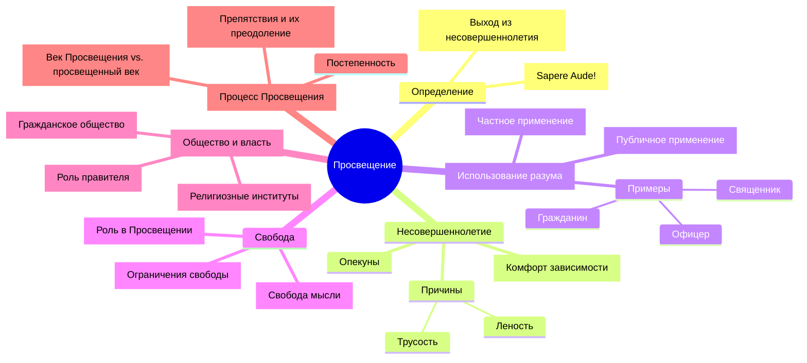

# Резюме эссе Канта "Что такое Просвещение?".

## Основная идея:
Просвещение - это выход человека из самонавязанного несовершеннолетия через обретение мужества пользоваться собственным разумом.

## Ключевые положения:
Несовершеннолетие - неспособность мыслить самостоятельно - результат лени и трусости.
Публичное использование разума должно быть свободным для достижения просвещения.
Частное использование разума может быть ограничено, но не должно препятствовать просвещению.
Постепенное просвещение общества предпочтительнее революции.

## Поддерживающие аргументы:

### Несовершеннолетие:
- Удобство полагаться на чужое мнение
- Роль "опекунов" в поддержании несовершеннолетия
- Трудность индивидуального выхода из несовершеннолетия

### Публичное использование разума:
- Право ученых и мыслителей свободно выражать идеи
- Важность критики для прогресса общества
- Роль свободы мысли в развитии просвещения

### Частное использование разума:
- Необходимость подчинения в рамках профессиональных обязанностей
- Баланс между общественным порядком и свободой мысли
- Примеры ограничений для военных, священников, чиновников

### Постепенное просвещение:
- Опасность резких перемен и революций
- Роль правителей в создании условий для просвещения
- Век Фридриха как пример движения к просвещению

## Заключение:
Просвещение - это длительный процесс, требующий свободы мысли и мужества пользоваться собственным разумом. Оно ведет к прогрессу общества и развитию человечества, но должно происходить постепенно, с учетом существующего общественного порядка.

