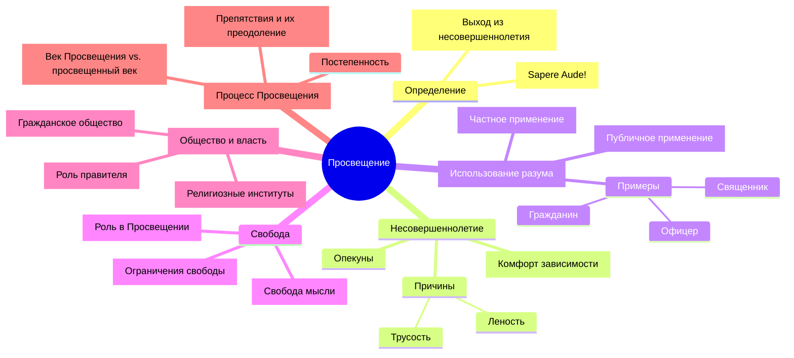

```mermaid
mindmap
  root((Просвещение))
    Определение
      ["Выход из несовершеннолетия"]
      ["Sapere Aude!"]
    Несовершеннолетие
      Причины
        Леность
        Трусость
      Опекуны
      ["Комфорт зависимости"]
    ["Использование разума"]
      ["Публичное применение"]
      ["Частное применение"]
      Примеры
        Священник
        Офицер
        Гражданин
    Свобода
      ["Свобода мысли"]
      ["Ограничения свободы"]
      ["Роль в Просвещении"]
    ["Общество и власть"]
      ["Роль правителя"]
      ["Гражданское общество"]
      ["Религиозные институты"]
    ["Процесс Просвещения"]
      Постепенность
      ["Век Просвещения vs. просвещенный век"]
      ["Препятствия и их преодоление"]
```