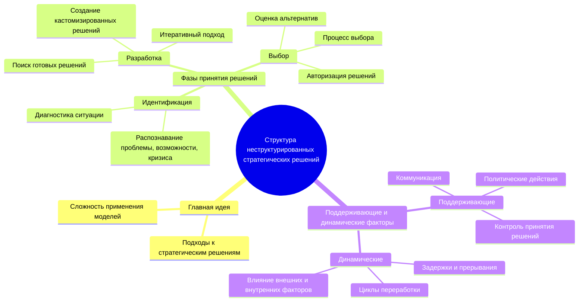

# Резюме статьи Минцберга "The Structure of “Unstructured” Decision Processes"

### Главная идея
Организации сталкиваются с трудностями при принятии неструктурированных стратегических решений, поскольку такие решения требуют подходов, отличающихся от тех, которые используются для рутинных задач. Существующие модели и методы редко оказываются эффективными для сложных, стратегически важных решений.

### Ключевые сообщения
1. **Определение стратегических решений:** Стратегические решения характеризуются высокой важностью, неопределенностью и отсутствием заранее определённых процедур, что делает их неструктурированными и уникальными для каждой ситуации.
  
2. **Этапы принятия решений:** Процесс стратегического принятия решений можно разделить на три основные фазы: идентификация, разработка и выбор. Эти фазы не всегда следуют строго последовательной логике и могут включать возвраты и итерации.

3. **Поддерживающие и динамические факторы:** Процесс принятия стратегических решений поддерживается коммуникацией, контролем принятия решений и политическими действиями. Динамические факторы, такие как задержки, прерывания и циклы переработки, играют важную роль в формировании процесса.

### Подробные аспекты
- **Идентификация:** Включает в себя распознавание необходимости в решении (определение проблемы, возможности или кризиса) и диагностирование ситуации для выявления причинно-следственных связей.
  
- **Разработка:** Включает поиск готовых решений или создание уникальных, кастомизированных решений, используя итеративный подход для достижения подходящего результата.

- **Выбор:** Заключительная фаза, включающая оценку и выбор наилучшего варианта, часто через многоэтапный процесс, включающий авторизацию и оценку рисков и возможностей.

