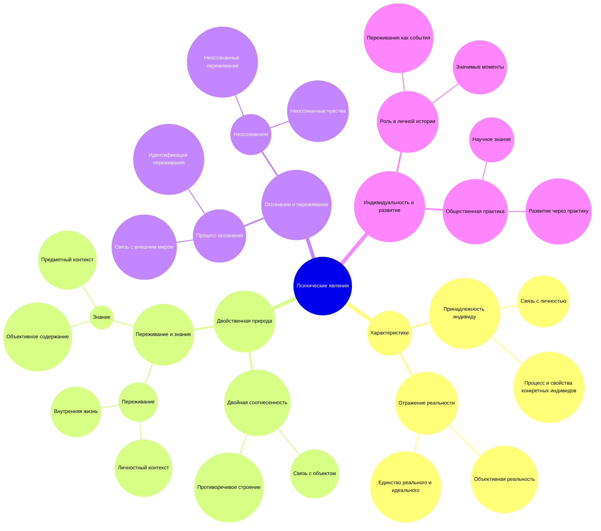

### 1. Основная идея:
Психические явления — это субъективные переживания индивида, отражающие его внутренний мир и отношение к внешней реальности. Они характеризуются двойственностью: принадлежат конкретному человеку и одновременно являются отражением внешнего мира.

### 2. Основные точки:
- **Субъективность психических явлений:** Они являются внутренними переживаниями индивида и тесно связаны с его личным опытом и жизненным контекстом.
- **Отражение объективной реальности:** Психика и сознание отражают внешний мир и объективную реальность, формируя осознанное бытие.
- **Двойная природа психических явлений:** Они являются одновременно реальной частью существования и его отражением, соединяя реальное и идеальное.

### 3. Поддерживающие детали:
- **Индивидуальная принадлежность:** Психические явления — это мысли, чувства, стремления, которые принадлежат субъекту и отражают его личный жизненный опыт.
- **Отношение к объектам:** Психические явления определяются через их связь с внешними объектами и реальностью, они не могут быть осмыслены вне этого контекста.
- **Переживание и знание:** Переживания отражают личный опыт и значимость событий для индивида, знание акцентирует связь с внешним миром и объективностью.
- **Динамика сознания:** Сознание представляет собой единство переживания и знания, их взаимодействие и взаимопроникновение, где каждое психическое явление имеет как личностный, так и объективный аспект.

### 4. Заключение:
Психические явления — это сложные образования, соединяющие личностный и объективный аспекты. Они отражают внутреннюю жизнь индивида и его взаимодействие с внешним миром, выражая единство субъективного и объективного в сознании человека.

