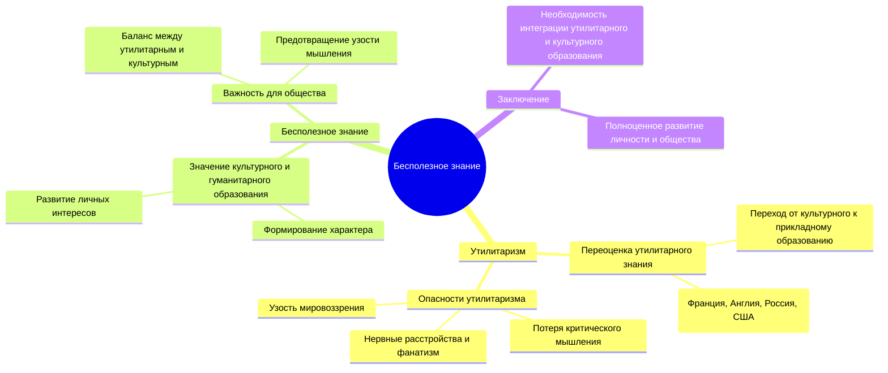

# Резюме статьи Рассела "Бесполезное" знание"

### Главная идея:
Современное общество переоценило утилитарное знание, игнорируя культурное и гуманистическое образование, что приводит к узкому и ограниченному мировоззрению.

### Поддерживающие аргументы:
1. **Переход к утилитаризму в образовании:**
   - Исторически знания ценились за их культурное и интеллектуальное значение. Однако начиная с XVIII века, акцент сместился в сторону прикладных наук и их непосредственного экономического применения.
   - В странах с традиционной системой образования, таких как Франция и Англия, утилитаризм проявлялся частично, но в других странах, например в России и США, он стал доминирующим.

2. **Опасности утилитаризма:**
   - Ограничение образования только прикладными знаниями лишает людей широкого гуманитарного мировоззрения и способствует развитию фанатизма и узкого профессионализма.
   - Люди, сосредоточенные исключительно на достижении конкретных целей, теряют способность к критическому мышлению и испытывают нервные расстройства из-за постоянного напряжения.

3. **Значение "бесполезного" знания:**
   - Культурные знания формируют характер и побуждают к интересу к неутилитарным ценностям, таким как искусство и философия, что важно для полноценного и счастливого общества.
   - "Бесполезное" знание помогает избежать узости мышления и способствует развитию личных интересов, что необходимо для баланса в жизни.

### Заключение:
Образование должно включать как утилитарные, так и культурные компоненты, чтобы обеспечить всестороннее развитие личности и предотвращение узкого и фанатичного мировоззрения.

