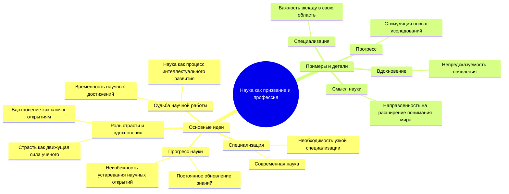

# М Вебер Наука как призвание и профессия

### Основной тезис:
Наука как профессия требует глубокой специализации, страсти и вдохновения, но в конечном счете научные достижения всегда устаревают, подчиняясь закону прогресса.

### Поддерживающие идеи:
1. **Специализация и прогресс**:
   - Современная наука требует строгой специализации, без которой невозможно создать что-либо значимое и долговечное.
   - Научная работа неизбежно устаревает, но именно это стимулирует прогресс.

2. **Роль страсти и вдохновения**:
   - Настоящий ученый должен обладать страстью и глубокой привязанностью к своему делу.
   - Вдохновение, несмотря на его спонтанность, является ключевым элементом в научных открытиях, но его нельзя вызвать по желанию.

3. **Научная работа и её судьба**:
   - Научные открытия всегда несут в себе элемент временности; они обречены быть превзойденными.
   - В отличие от искусства, где совершенство неподвластно времени, в науке каждое новое достижение становится ступенькой для следующих открытий.

### Поддерживающие детали:
- **Специализация**: В условиях современной науки, лишь благодаря специализации ученый может внести значимый вклад в свою область.
- **Прогресс**: Каждый научный труд предопределен устаревать, что стимулирует новые исследования и открытия.
- **Вдохновение**: Вдохновение не приходит по заказу; оно рождается из упорной работы и зачастую появляется неожиданно.
- **Смысл науки**: Научная деятельность направлена не только на практическое применение, но и на продолжение бесконечного процесса интеллектуализации общества.

